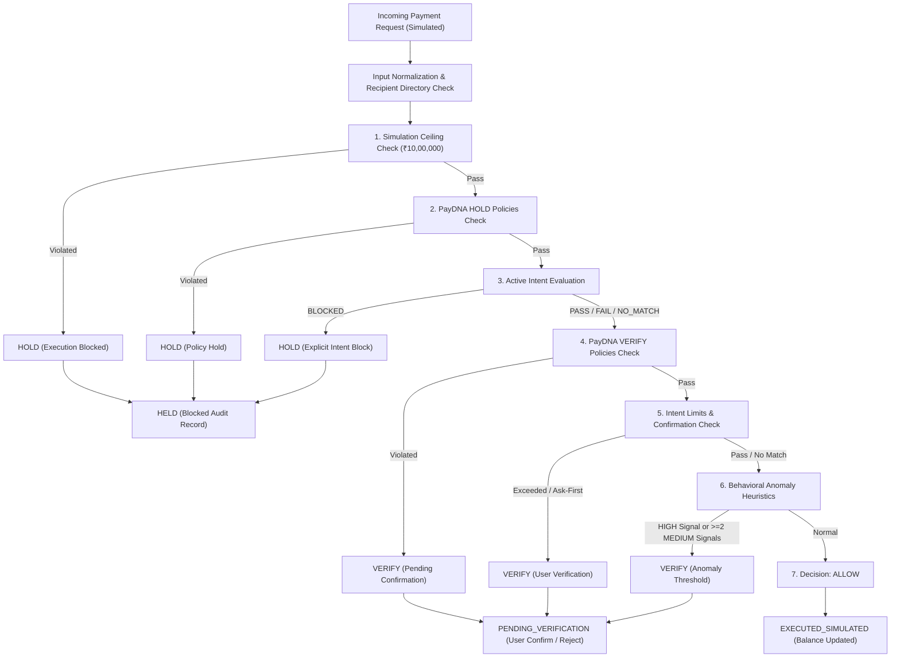

# INTENTPAY — Programmable Payments That Understand Your Intent

> **MANDATORY DISCLAIMER:**  
> **This is a hackathon prototype using simulated payment execution. It does not process real money, real credentials, or interact with banking/UPI rails.**  
> IntentPay is strictly a *policy and decision layer around* digital payments (not a fraud model, not an expense tracker, not a bank replacement).

---

## 🚀 Overview

**IntentPay** transforms digital payments by introducing a programmable policy, behavioral anomaly, and intent-verification layer around payment execution. Instead of blind payment authorizations, IntentPay validates every transaction against:

1. **Natural-Language Payment Intents** (e.g., auto-pay electricity bill if ≤ ₹3,000; block gambling/betting).
2. **PayDNA Security Policies** (e.g., single transaction ceilings, new recipient limits, rolling 7-day and 30-day category caps).
3. **Deterministic Behavioral Anomaly Signals** (empirical baselines: amount spikes, unusual time bands, rapid frequency surges).
4. **Cash-Flow Liquidity Impact & What-If Stress Testing** (real-time runway and balance projection).

---

## 🏛️ Architecture & Decision Hierarchy



### Deterministic Financial Philosophy
All payment math, policy evaluations, behavioral signals, and explanations are computed using **100% deterministic Python logic**. The Large Language Model (Gemini 2.5 Flash via plain REST) is strictly constrained to parsing natural language text into structured JSON drafts. If the LLM is unreachable, offline, or returns malformed data, an integrated deterministic fallback regex parser guarantees zero-failure operation.

---

## 🛠️ Tech Stack

- **Frontend:** React, Vite, Tailwind CSS (Dark "Payment Control Console" theme), Lucide Icons, Recharts.
- **Backend:** FastAPI, Python 3.11+, Pydantic v2, SQLAlchemy 2.0.
- **Database:** SQLite with deterministic seed data (`seed.py`).
- **AI / NL Parsing:** Gemini 2.5 Flash (`httpx` REST call) with resilient zero-key regex fallback parser.

---

## ⚡ Quick Start

### Prerequisites
- Python 3.11+
- Node.js 18+ and npm

### 1. Clone & Setup
```bash
git clone https://github.com/Praveena-2907/IntentPay.git
cd IntentPay
```

### 2. Backend Setup
```bash
cd backend
pip install -r requirements.txt
python -m uvicorn app.main:app --host 127.0.0.1 --port 8000 --reload
```

### 3. Frontend Setup (in a separate terminal)
```bash
cd frontend
npm install
npm run dev
```

Open [http://localhost:5173](http://localhost:5173) to launch the Payment Control Console.

---

## 🧪 Verification & Automated Suites

Run full backend test suite:
```bash
cd backend
pytest -v
```

Run frontend build & util tests:
```bash
cd frontend
npm run build
npm test
```

Run server smoke test:
```bash
python scripts/smoke.py http://127.0.0.1:8000
```

---

## 🔒 Security & Privacy
- **Zero Real Money:** All ledger items are simulated execution tokens.
- **Client Idempotency:** Payment requests utilize `client_request_id` to guarantee idempotent execution.
- **Immutable Traces:** Every decision stores a 9-stage audit trace for complete transparency and explainability.
